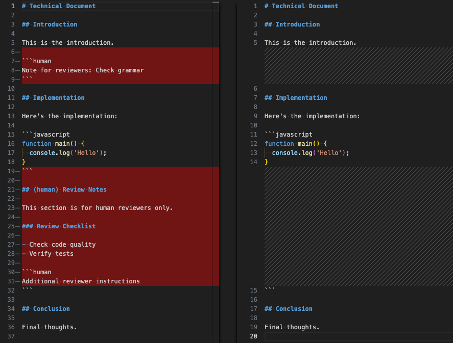

# remark-remove-human

markdown is no longer for humans, it is for AI.

However, there are still cases where we want to include human-readable content within markdown.

This [remark](https://github.com/remarkjs/remark) plugin provides the ability to remove human-readable content from markdown files, making markdown useful for both humans and AI.



## Installation

```bash
npm install -D remark-remove-human
```

## Usage

[input.md](test/fixtures/combined-functionality/input.md):

````markdown file=test/fixtures/combined-functionality/input.md
# Technical Document

## Introduction

This is the introduction.

```human
Note for reviewers: Check grammar
```

## Implementation

Here's the implementation:

```javascript
function main() {
  console.log('Hello');
}
```

## (human) Review Notes

This section is for human reviewers only.

### Review Checklist

- Check code quality
- Verify tests

```human
Additional reviewer instructions
```

## Conclusion

Final thoughts.
````

[expected.md](test/fixtures/combined-functionality/expected.md):

````markdown file=test/fixtures/combined-functionality/expected.md
# Technical Document

## Introduction

This is the introduction.

## Implementation

Here's the implementation:

```javascript
function main() {
  console.log('Hello');
}
```

## Conclusion

Final thoughts.
````

The above transformation can be performed using the following code:

```javascript
import { remark } from 'remark';
import remarkRemoveHuman from 'remark-remove-human';

const input = await readFile(inputPath, 'utf-8');

const result = await remark()
  .use(remarkRemoveHuman)
  .process(input);

console.log(result.toString());
```

## API

### `remarkRemoveHuman() (default)`

Removes code blocks with language identifier `human` and headings
prefixed with `(human)` along with all their subsections.

###### Parameters

There are no parameters.

###### Returns

Transform (`(tree: Root) => void`).

## File extensions

If you want to use file extensions to determine whether to apply this plugin, the following extensions are recommended:

- `.mdh`
  - Markdown for human
- `.mdxh`
  - MDX for human

## License

MIT
